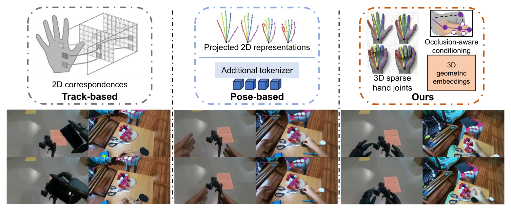

<div align="center">

# Controllable Egocentric Video Generation via Occlusion-Aware Sparse 3D Hand Joints

### ECCV 2026

[Chenyangguang Zhang](https://zhangcyg.github.io/)&nbsp;&nbsp;·&nbsp;&nbsp;[Botao Ye](https://botaoye.github.io/)&nbsp;&nbsp;·&nbsp;&nbsp;Boqi Chen&nbsp;&nbsp;·&nbsp;&nbsp;[Alexandros Delitzas](https://alexdelitzas.github.io/)&nbsp;&nbsp;·&nbsp;&nbsp;[Fangjinhua Wang](https://fangjinhuawang.github.io/)&nbsp;&nbsp;·&nbsp;&nbsp;[Marc Pollefeys](https://people.inf.ethz.ch/marc.pollefeys/)&nbsp;&nbsp;·&nbsp;&nbsp;[Xi Wang](https://xiwang1212.github.io/homepage/)

[](https://arxiv.org/pdf/2603.11755)
[](https://zhangcyg.github.io/handcontrolvideo/)
[](https://huggingface.co/CyrusZhang312/JointControlvideo)
[](#dataset)
[](LICENSE)

</div>

<p align="center">
  
</p>

> Given a starting frame and a sequence of 3D hand-joint trajectories, our method generates egocentric hand-object interaction videos that faithfully follow the prescribed hand motion — using occlusion-aware conditioning on sparse 3D hand joints instead of dense 2D tracks or projected pose tokens.

---

## Overview

This repository contains the official implementation of **"Controllable Egocentric Video Generation via Occlusion-Aware Sparse 3D Hand Joints"**, built on top of the [Wan2.1-I2V-14B-480P](https://huggingface.co/Wan-AI/Wan2.1-I2V-14B-480P) video diffusion backbone.

Given a starting frame and a sequence of 3D hand-joint trajectories, our model synthesizes an egocentric video that follows the prescribed hand motion, using:

- an **occlusion-aware conditioning module** that down-weights unreliable features from occluded joints,
- **3D geometric embeddings** injected directly into the latent space (no extra tokenizer / dense 2D projection required),
- a released **`HandConditioningModule`** trained on top of a frozen Wan2.1 backbone via LoRA.

---

## Checkpoints

🤗 [CyrusZhang312/JointControlvideo](https://huggingface.co/CyrusZhang312/JointControlvideo) 

The checkpoint bundle contains two files: `dit.safetensors` (LoRA weights + expanded `patch_embedding`) and `hand-controller.safetensors` (the `HandConditioningModule`). 

## Dataset

🤗 [Coming soon] — an automatically-annotated egocentric dataset of hand-object interaction clips paired with precise 3D hand trajectories.

---

## Environment setup

The training and released checkpoints were produced inside the NGC `pytorch:25.03` container (PyTorch 2.7, CUDA 12.8, Python 3.12) with a layered Python venv. The recipe below reproduces that environment from a standard conda + pip install — no NGC image required.

### 1. Create the conda environment

```bash
conda create -n handcontrolvideo python=3.12 -y
conda activate handcontrolvideo
```

### 2. Install PyTorch (pick the wheel matching your CUDA driver)

```bash
# CUDA 12.8 (matches the NGC 25.03 release used for training)
pip install torch==2.7.0 torchvision --index-url https://download.pytorch.org/whl/cu128

# CUDA 12.4 fallback
# pip install torch==2.7.0 torchvision --index-url https://download.pytorch.org/whl/cu124
```

### 3. Install the rest of the dependencies

```bash
pip install -r requirements.txt
pip install -e .                          # registers the `diffsynth` package
```

`requirements.txt` pins everything to the exact versions that produced the released checkpoints (`accelerate==1.12.0`, `transformers==4.57.2`, `peft==0.18.0`, `h5py==3.15.1`, `lmdb==1.7.5`, `av==16.0.1`, `opencv-python-headless==4.11.0.86`, `smplx==0.1.28`, `chumpy==0.70`, etc.).

### 4. (Optional) HuggingFace cache

The Wan2.1 backbone (text encoder, VAE, CLIP, base DiT) is downloaded from HuggingFace on first use; set `HF_HOME` to keep it in a known location:

```bash
export HF_HOME=$PWD/.hf_cache
```

---

## Inference

A single-sample demo script reads a 3D hand-joint trajectory from the dataset and renders one controlled video:

```bash
python inf_wm_hand.py
```

Output goes to `outputs/`. To use your own data, edit the dataset paths near the bottom of the script.

---

## Training

```bash
bash train_script_joint_control.sh        
```

This runs `accelerate launch` against the trainer (`examples/wanvideo/model_training/train.py`). Key trainer flags:

- `--num_joints 42` — MANO joint count for the `HandConditioningModule`
- `--use_lmdb_dataset` — read videos + H5 joint trajectories from an LMDB store

adjust `--num_machines` / `--num_processes` in `accelerate launch` to match your setup. Training was orchestrated under SLURM; the specific `sbatch` wrappers are not included since they are cluster-specific (the `accelerate launch` block inside the shell script is the portable part).

---

## Acknowledgement

This codebase is a focused fork of [DiffSynth-Studio](https://github.com/modelscope/DiffSynth-Studio); the Wan2.1 pipeline, model loader and training framework are upstream components.

## Citation

If you find this work useful, please consider citing:

```bibtex
@inproceedings{zhang2026controllable,
  title     = {Controllable Egocentric Video Generation via Occlusion-Aware Sparse 3D Hand Joints},
  author    = {Zhang, Chenyangguang and Ye, Botao and Chen, Boqi and Delitzas, Alexandros and Wang, Fangjinhua and Pollefeys, Marc and Wang, Xi},
  booktitle = {European Conference on Computer Vision (ECCV)},
  year      = {2026}
}
```
